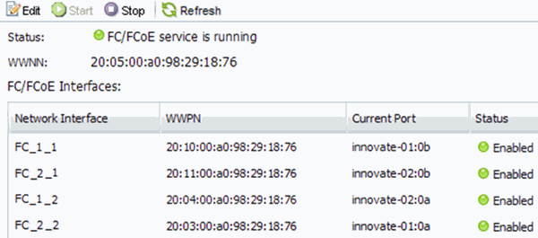

= 既存の SVM で FC サービスが実行されていることを確認する
:allow-uri-read: 
:icons: font
:imagesdir: ../media/

[role="lead"]
既存の Storage Virtual Machine （ SVM ）を使用する場合、 ONTAP System Manager を使用して、 SVM で FC サービスが実行されていることを確認する必要があります。また、 FC 論理インターフェイス（ LIF ）がすでに作成されていることも確認する必要があります。

.作業を開始する前に
新しい LUN を作成する既存の SVM を選択しておく必要があります。

.手順
. SVMs ウィンドウに移動します。
. 必要な SVM を選択します。
. SVM の設定 * タブを選択します。
. [* Protocols] ペインで、 [*FC/FCoE*] を選択します。
. FC サービスの実行状況を確認
+

+
FC サービスが実行されていない場合は、 FC サービスを開始するか、新しい SVM を作成します。

. ノードごとに少なくとも 2 つの FC LIF が表示されていることを確認します。
+
ノードあたりの FC LIF の数が 2 つより少ない場合は、 SVM で FC の構成を更新するか、 FC 用に新しい SVM を作成します。

