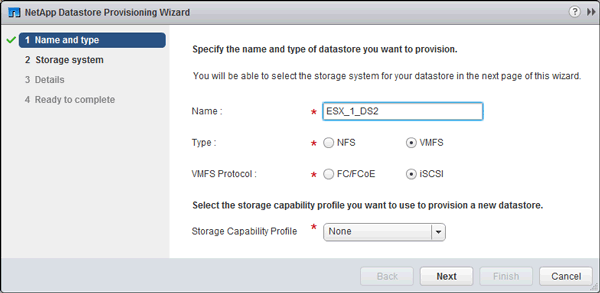

= データストアをプロビジョニングし、そのデータストアを格納する LUN とボリュームを作成する
:allow-uri-read: 
:icons: font
:imagesdir: ../media/

[role="lead"]
データストアには、 ESXi ホストの仮想マシンとその VMDK が格納されます。ESXi ホストのデータストアは、ストレージクラスタの LUN にプロビジョニングします。

.作業を開始する前に
Virtual Storage Console for VMware vSphere （ VSC ）をインストールし、 ESXi ホストを管理する vCenter Server に登録しておく必要があります。

VSC に、クラスタまたは Storage Virtual Machine （ SVM ）に LUN およびボリュームを作成するための十分な権限が必要です。

.このタスクについて
VSC では、データストアを自動でプロビジョニングすることができ、 LUN とボリュームも指定した SVM に自動的に作成されます。

.手順
. vSphere Web Client * Home * ページで、 * Hosts and Clusters * をクリックします。
. ナビゲーションペインで、データストアをプロビジョニングするデータセンターを展開します。
. ESXi ホストを右クリックし、 * NetApp VSC * > * Provision Datastore * を選択します。
+
また、プロビジョニング時にクラスタを右クリックして、クラスタ内のすべてのホストでデータストアを使用できるようにすることもできます。

. ウィザードで必要な情報を指定します。
+

+
** データストアタイプとして * VMFS * を選択します。
** VMFS プロトコルとして * iscsi * を選択します。
** ストレージ機能プロファイルとして「 * なし」を選択します。
** 「シンプロビジョニング」のボックスを選択します。
** [ 新しいボリュームの作成 *] チェックボックスをオンにします。

