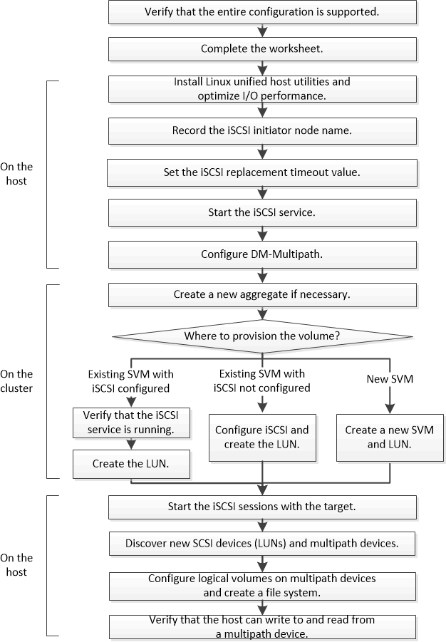

= iSCSI の構成とプロビジョニングのワークフロー
:allow-uri-read: 
:icons: font
:imagesdir: ../media/

[role="lead"]
iSCSI を使用してホストでストレージを利用できるようにするには、 Storage Virtual Machine （ SVM ）でボリュームと LUN をプロビジョニングし、ホストから LUN に接続します。

