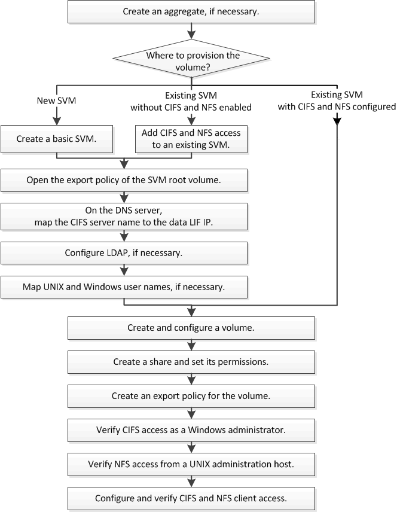

= マルチプロトコルの設定ワークフロー
:allow-uri-read: 
:icons: font
:imagesdir: ../media/

[role="lead"]
SMB / CIFS と NFS の両方を設定するには、必要に応じてアグリゲートの作成と新しい SVM の作成または既存の SVM の設定を行ってから、ボリューム、共有、およびエクスポートを作成し、 UNIX および Windows の管理ホストからアクセスできることを確認します。その後、 SMB / CIFS クライアントと NFS クライアントへのアクセスを開始できます。

