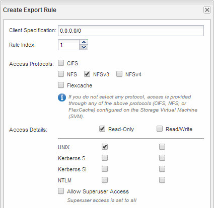

= SVM ルートボリュームのエクスポートポリシーを開く（既存の SVM への NFS アクセスの設定）
:allow-uri-read: 
:icons: font
:imagesdir: ../media/

[role="lead"]
デフォルトのエクスポートポリシーにルールを追加して、すべてのクライアントに NFSv3 経由でのアクセスを許可する必要があります。このようなルールを追加しないと、 Storage Virtual Machine （ SVM ）とそのボリュームに対する NFS クライアントのアクセスがすべて拒否されます。

.このタスクについて
すべての NFS アクセスをデフォルトのエクスポートポリシーとして指定してから、ボリュームごとにカスタムのエクスポートポリシーを作成して各ボリュームへのアクセスを制限します。

.手順
. SVMs ウィンドウに移動します。
. SVM の設定 * タブをクリックします。
. [* Policies * （ポリシー * ） ] ペインで、 [* Export Policies （エクスポートポリシー * ） ] をクリックします。
. SVM ルートボリュームに適用されている * default * という名前のエクスポートポリシーを選択します。
. 下部ペインで、 * 追加 * をクリックします。
. Create Export Rule * ダイアログボックスで、 NFS クライアントのすべてのクライアントにアクセスするためのルールを作成します。
+
.. [Client Specification]フィールドに、次のように入力します。 `0.0.0.0/0` ルールがすべてのクライアントを環境するようにします。
.. ルールインデックスのデフォルト値は * 1 * のままにします。
.. 「 * NFSv3 」を選択します。
.. [* 読み取り専用 *] の下にある [*UNIX*] チェックボックス以外のすべてのチェックボックスをオフにします。
.. [OK] をクリックします。

+

.結果
SVM に作成したすべてのボリュームに NFSv3 クライアントからアクセスできるようになります。
