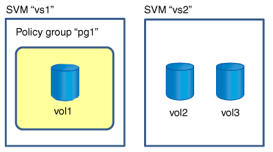
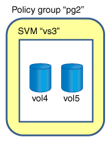

= ポリシーグループへのストレージオブジェクトの割り当てに関するルール
:allow-uri-read: 
:icons: font
:imagesdir: ../media/

[role="lead"]
ストレージ QoS ポリシーグループにストレージオブジェクトを割り当てる際のルールを把握しておく必要があります。

== ストレージオブジェクトとポリシーグループは同じ SVM に属している必要があります

ストレージオブジェクトは、ポリシーグループが属している SVM に含まれている必要があります。ポリシーグループが属する SVM は、ポリシーグループを作成するときに指定します。同じ SVM に複数のポリシーグループを作成することができます。

次の図では、ポリシーグループ pg1 が SVM vs1 に属しています。ボリューム vol2 とボリューム vol3 は別の SVM に含まれているため、これらのボリュームをポリシーグループ pg1 に割り当てることはできません。

== ネストされたストレージオブジェクトはポリシーグループに含めることはできません

下位のオブジェクトまたは子オブジェクトがポリシーグループに属している場合は、そのストレージオブジェクトをポリシーグループに割り当てることはできません。次の表に、制限事項を示します。

|===
| 割り当て内容 | 以下のオブジェクトはポリシーグループに割り当てできない 

 a| 
SVM をポリシーグループに割り当てます
 a| 
SVM に含まれているストレージオブジェクトのポリシーグループへの割り当て

 a| 
ボリューム：ポリシーグループに割り当てます
 a| 
そのボリュームを含む SVM または子 LUN

 a| 
LUN
 a| 
その LUN を含むボリュームまたは SVM

 a| 
ファイルをポリシーグループに追加します
 a| 
そのファイルを含むボリュームまたは SVM

|===
次の図では、 SVM vs3 がポリシーグループ pg2 に割り当てられています。ストレージ階層のオブジェクト（ SVM vs3 ）がポリシーグループに割り当てられているため、ボリューム vol4 またはボリューム vol5 をポリシーグループに割り当てることはできません。

