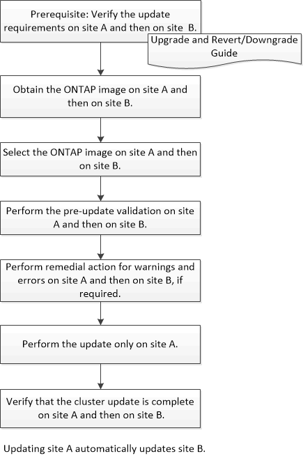

= MetroCluster 構成のクラスタを System Manager ONTAP 9.7 以前を使用して更新する
:allow-uri-read: 
:icons: font
:imagesdir: ../media/

[role="lead"]
ONTAP MetroCluster 構成のクラスタを更新するには、 System Manager クラシック（ ONTAP 9.7 以前で使用可能）を使用します。クラスタの更新以外の処理は、すべて両方のクラスタで実行する必要があります。

* 関連情報 *

https://docs.netapp.com/us-en/ontap/upgrade/task_upgrade_andu_sm.html["ONTAPのアップグレード"]
