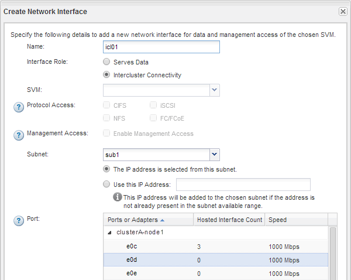

= すべてのノードにクラスタ間インターフェイスを作成（ ONTAP 9.2 以前）
:allow-uri-read: 
:icons: font
:imagesdir: ../media/

[role="lead"]
ONTAP 9.2 以前の ONTAP 9 リリースでの ONTAP の system_classic_ インターフェイスを使用して、ピアリングに使用するクラスタ間 LIF を作成できます。

クラスタ間の相互通信には、クラスタ間通信専用の論理インターフェイス（ LIF ）を使用します。クラスタ間 LIF は、ピアリングに使用する各 IPspace 内に作成する必要があります。  ピア関係を作成する各クラスタの各ノードで LIF を作成する必要があります。

.作業を開始する前に
クラスタ間 LIF に使用するサブネットとポート、およびオプションで IP アドレスを特定しておく必要があります。

.このタスクについて
この手順は、ピア関係を作成する両方のクラスタで実行する必要があります。たとえば、 4 ノードクラスタを IPspace A 上でクラスタ X とピアリングし、 IPspace Y 上でクラスタ Y とピアリングする場合、合計 8 個のクラスタ間 LIF が必要です。 IPspace A に 4 つ（ノードごとに 1 つ）、 IPspace Y に 4 つ（ノードごとに 1 つ）。

.手順
. [step1-intercluster-lif ]] ソースクラスタの 1 つのノードにクラスタ間 LIF を作成します。
+
.. Network Interfaces * ウィンドウに移動します。
.. [ 作成（ Create ） ] をクリックします。
+
Create Network Interface ダイアログボックスが表示されます。

.. クラスタ間 LIF の名前を入力します。
+
最初のノードのクラスタ間 LIF には「 icl01 」、 2 つ目のノードのクラスタ間 LIF には「 icl02 」を使用します。

.. インターフェイスの役割として「 * Intercluster Connectivity * 」を選択します。
.. IPspace を選択します。
.. Add Details * ダイアログボックスの * Assign IP Address * ドロップダウン・リストから * using a subnet * を選択し、クラスタ間通信に使用するサブネットを選択します。
+
デフォルトでは、「 * Create * 」をクリックすると、 IP アドレスがサブネットから自動的に選択されます。自動的に選択された IP アドレスを使用しない場合は、ノードがクラスタ間通信に使用する IP アドレスを手動で指定する必要があります。

.. ノードがクラスタ間通信に使用する IP アドレスを手動で指定する場合は、「 * この IP アドレスを使用する * 」を選択し、 IP アドレスを入力します。
+
すでにサブネットにあるか、あとでサブネットに追加できる IP アドレスを指定する必要があります。

.. [*Ports] 領域で、設定するノードをクリックし、このノードに使用するポートを選択します。
.. データ通信とのクラスタ間通信でポートを共有しない場合は、選択したポートが *Hosted Interface Count* 列に「 0 」と表示されていることを確認します。
+

.. [ 作成（ Create ） ] をクリックします。

. 繰り返します <<step1-intercluster-lif,手順 1.>> クラスタ内のノードごとに割り当てます。
+
クラスタ内の各ノードにクラスタ間 LIF が作成されます。

. あとで他のクラスタとのピア関係を作成するときに使用できるように、クラスタ間 LIF の IP アドレスをメモします。
+
.. [ * ネットワーク・インターフェイス * ] ウィンドウの [ * 役割 * ] 列で、をクリックします image:../media/icon_columnfilter_sm_peering.gif["列フィルタアイコン"]をクリックして [ * すべて * ] チェックボックスをオフにし、 [ * クラスタ間 * ] を選択します。
+
Network Interfaces ウィンドウには、クラスタ間 LIF だけが表示されます。

.. [IP Addresses/wwpn * ] 列に表示される IP アドレスをメモするか、あとで IP アドレスを取得できるように [ * ネットワークインターフェイス * ] ウィンドウを開いたままにします。
+
列表示アイコン（image:../media/icon_columnshowhide_sm_onc_peering.gif["列を表示または非表示にするアイコン"]）をクリックして、表示しない列を非表示にします。

.結果
各クラスタ内のすべてのノードに、相互に通信できるクラスタ間 LIF が作成されています。
