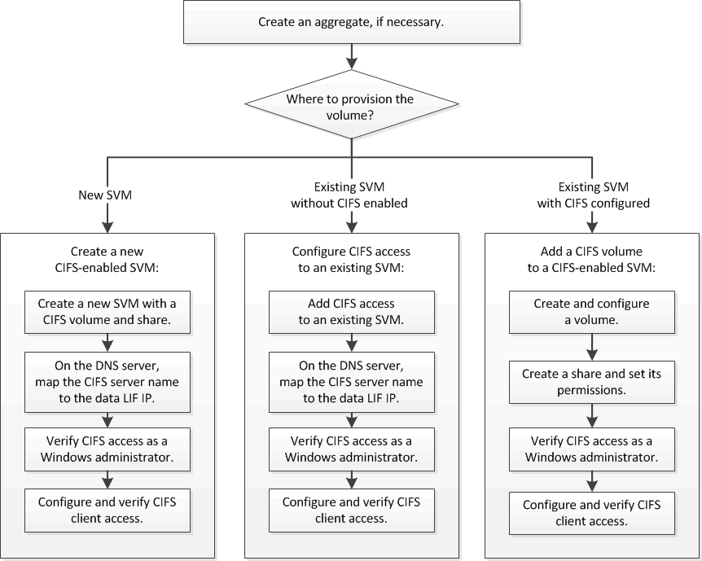

= SMB / CIFS の設定ワークフロー
:allow-uri-read: 
:icons: font
:imagesdir: ../media/

[role="lead"]
SMB / CIFS を設定するには、必要に応じてアグリゲートを作成してから、目的に応じたワークフローに従います。 CIFS 対応 SVM を新規に作成するか、既存の SVM への CIFS アクセスを設定するか、すでに CIFS アクセスの設定が完了している既存の SVM に CIFS ボリュームを追加するかによってワークフローが異なります。

