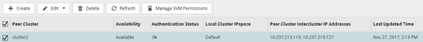

= クラスタピア関係と SVM ピア関係を確認
:allow-uri-read: 
:icons: font
:imagesdir: ../media/

[role="lead"]
SnapVault テクノロジを使用したデータ保護の設定を開始する前に、ソースクラスタとデスティネーションクラスタがピアとして設定され、ピア関係を通じて相互に通信していることを確認する必要があります。また、ソース SVM とデスティネーション SVM がピアとして設定され、ピア関係を通じて相互に通信していることも確認する必要があります。

.このタスクについて
このタスクは * source * cluster で実行する必要があります。

== 手順

* ONTAP 9.3 以降を実行している場合は、次の手順に従ってクラスタピア関係と SVM ピア関係を確認します。
+
.. [ * Configuration * ] > [* Cluster Peers* ] をクリックします。
.. ピアクラスタが認証済みで使用可能であることを確認します。
+

.. [ * Configuration * > * SVM peers * ] をクリックします。
.. デスティネーション SVM がソース SVM とピア関係にあることを確認します。

* ONTAP 9.2 以前を実行している場合は、次の手順を実行してクラスタピア関係と SVM ピア関係を確認します。
+
.. [* 構成 * （ Configurations * ） ] タブをクリックします。
.. [* Cluster Details] ペインで、 [* Cluster Peers* ] をクリックします。
.. ピアクラスタが認証済みで使用可能であることを確認します。
+
image::../media/cluster_peer_health_backup.gif[クラスタピアヘルスバックアップ]

.. SVM * タブをクリックし、ソース SVM を選択します。
.. ピア Storage Virtual Machines * 領域で、デスティネーション SVM がソース SVM とピア関係にあることを確認します。
+
この領域にピア関係にある SVM が表示されない場合は、 SnapVault 関係を作成するときに SVM ピア関係を作成できます。

+
xref:task_creating_snapvault_relationship_92_earlier.adoc[SnapVault 関係の作成（ ONTAP 9.2 以前）]

