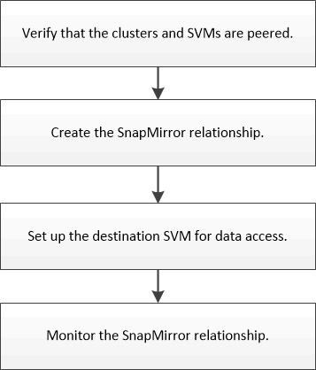

= ボリュームのディザスタリカバリの準備ワークフロー
:allow-uri-read: 
:icons: font
:imagesdir: ../media/

[role="lead"]
ボリュームのディザスタリカバリの準備では、クラスタピア関係を確認し、ピア関係にある双方のクラスタのボリューム間で SnapMirror 関係を作成し、データアクセスのためのデスティネーション SVM を設定して、 SnapMirror 関係を定期的に監視します。

ディザスタリカバリの設定をテストする場合や災害の発生時にデスティネーションボリュームをアクティブ化する方法については、別のドキュメントで説明しています。災害発生後にソースボリュームを再アクティブ化する方法も、それらのドキュメントで確認できます。

xref:../volume-disaster-recovery/index.html[ボリュームディザスタリカバリ]

[+]
ONTAP で災害の発生後にデスティネーションボリュームをアクティブ化し、リカバリ後にソースボリュームを再アクティブ化する簡単な方法について説明しています。
