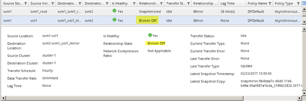

= SnapMirror 関係を解除
:allow-uri-read: 
:icons: font
:imagesdir: ../media/

[role="lead"]
デスティネーションボリュームをアクティブ化するには、 SnapMirror 関係を休止して解除する必要があります。休止した時点で、以降の SnapMirror データ転送は無効になります。

.作業を開始する前に
デスティネーションボリュームをデスティネーション SVM ネームスペースにマウントしておく必要があります。

.このタスクについて
このタスクは、 * デスティネーション * クラスタから実行する必要があります。

.手順
. 実行している System Manager のバージョンに応じて、次のいずれかの手順を実行します。
+
** ONTAP 9.4 以前： ［ * 保護 * ］ > ［ * 関係 * ］ をクリックします。
** ONTAP 9.5 以降： * Protection * > * Volume Relationships * をクリックします。

. ソースボリュームとデスティネーションボリュームの間の SnapMirror 関係を選択します。
. [* 操作 *>] [ * 休止 ] をクリックして、以降のデータ転送を無効にします。
. 確認のチェックボックスをオンにし、 * 休止 * をクリックします。
+
休止処理には時間がかかることがあります。転送ステータスが `Quiesced`。

. [ 操作（ Operations ） ] > [ * 分割（ * Break ） ] をクリックする。
. 確認のチェックボックスをオンにし、 * ブレーク * をクリックします。
+
image::../media/break.gif[SnapMirror の解除画面]

+
SnapMirror関係の状態 `Broken Off` 状態。

+

