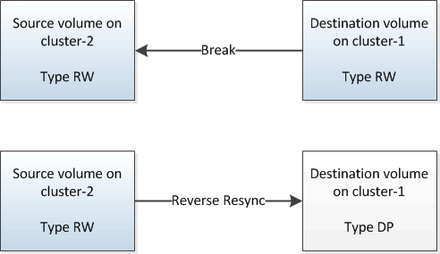
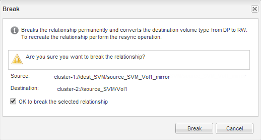

= ソースボリュームを再アクティブ化
:allow-uri-read: 
:icons: font
:imagesdir: ../media/

[role="lead"]
デスティネーションボリュームからソースボリュームにデータを再同期したら、 SnapMirror 関係を解除してソースボリュームをアクティブ化する必要があります。その後、デスティネーションボリュームを再同期して、再アクティブ化したソースボリュームを保護します。

.このタスクについて
関係の解除と逆再同期の処理は、いずれも * ソース * クラスタから実行されます。

次の図に示すように、 SnapMirror 関係を解除すると、ソースボリュームとデスティネーションボリュームの両方が読み取り / 書き込み可能になります。逆再同期処理の実行後は、アクティブなソースボリュームから読み取り専用のデスティネーションボリュームにデータがレプリケートされます。

.手順
. 実行している System Manager のバージョンに応じて、次のいずれかの手順を実行します。
+
** ONTAP 9.4 以前： ［ * 保護 * ］ > ［ * 関係 * ］ をクリックします。
** ONTAP 9.5 以降： * Protection * > * Volume Relationships * をクリックします。

. ソースボリュームとデスティネーションボリュームの間の SnapMirror 関係を選択します。
. [* 操作 *>] [ * 休止 ] をクリックします。
. 確認のチェックボックスをオンにし、 * 休止 * をクリックします。
. [ 操作（ Operations ） ] > [ * 分割（ * Break ） ] をクリックする。
. 確認のチェックボックスをオンにし、 * ブレーク * をクリックします。
+
 ダイアログボックスを示すスクリーンショット。]

. [* Operations] * > [* Reverse Resync] をクリックします。
. 確認のチェックボックスをオンにし、 * 逆再同期 * をクリックします。
+
image::../media/snapmirror_return_reverse_resync.gif[逆再同期（ Reverse Resync ）ダイアログボックスを示すスクリーンショット]

+
ONTAP 9.3以降では、関係のSnapMirrorポリシーがに設定されます。 `MirrorAllSnapshots` SnapMirrorスケジュールはに設定されています。 `None`。

+
ONTAP 9.2以前を実行している場合は、関係のSnapMirrorポリシーがに設定されます。 `DPDefault` SnapMirrorスケジュールはに設定されています。 `None`。

. ボリュームのページでソースボリュームに移動し、作成したSnapMirror関係がリストに表示され、関係の状態がになっていることを確認します。 `Snapmirrored`。
. デスティネーションクラスタで、元の SnapMirror 関係の保護設定と同じになるように、新しい SnapMirror 関係の SnapMirror ポリシーとスケジュールを指定します。
+
.. 実行している System Manager のバージョンに応じて、次のいずれかの手順を実行します。
+
*** ONTAP 9.4 以前： ［ * 保護 * ］ > ［ * 関係 * ］ をクリックします。
*** ONTAP 9.5 以降： * Protection * > * Volume Relationships * をクリックします。

.. 再アクティブ化したソースボリュームとデスティネーションボリューム間の SnapMirror 関係を選択し、 * Edit * をクリックします。
.. SnapMirror ポリシーとスケジュールを選択し、 * OK * をクリックします。

.結果
ソースボリュームに読み取り / 書き込みアクセスが設定され、デスティネーションボリュームで保護されます。
