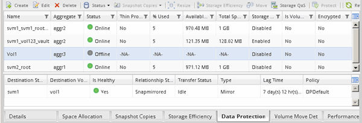

= ソースボリュームのステータスを確認
:allow-uri-read: 
:icons: font
:imagesdir: ../media/

[role="lead"]
ソースボリュームを使用できないときは、ソースボリュームがオフラインになっていることを確認し、データアクセスのためにアクティブ化する必要があるデスティネーションボリュームを確認する必要があります。

.このタスクについて
このタスクは * source * cluster で実行する必要があります。

.手順
. [* Volumes （ボリューム） ] ウィンドウに移動します。
. ソースボリュームを選択し、ソースボリュームがオフラインになっていることを確認します。
. SnapMirror 関係のデスティネーションボリュームを特定します。
+
** ONTAP 9.3 以降：ソースボリュームをダブルクリックして詳細を表示し、 * protection * をクリックして、 SnapMirror 関係のデスティネーションボリュームと、ボリュームが含まれている SVM の名前を特定します。
+
image::../media/snapmirror_destination_93.gif[SnapMirror デスティネーション 93]

** ONTAP 9.2 以前： Volumes （ボリューム）ページの下部にある * Data Protection * （データ保護 * ）タブをクリックして、 SnapMirror 関係のデスティネーションボリュームと、ボリュームが含まれている SVM の名前を確認します。
+

