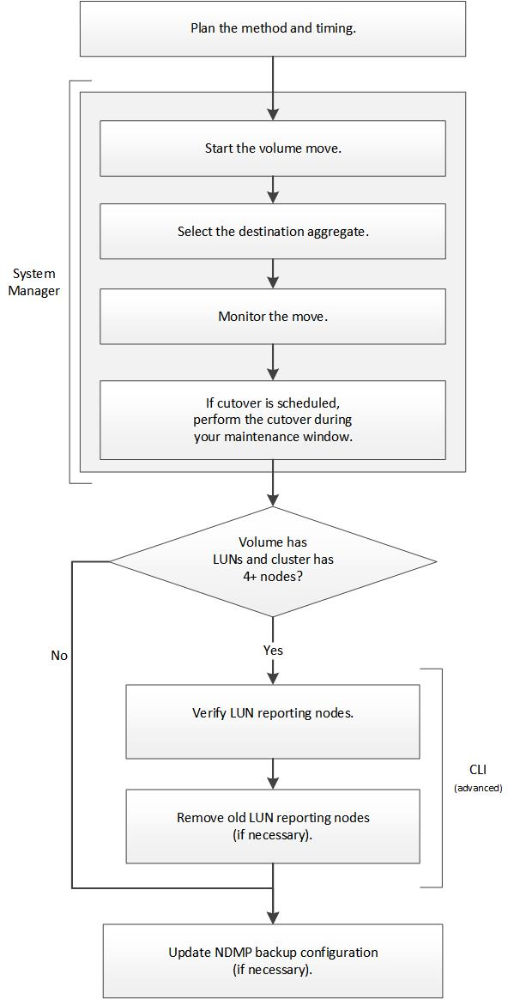

= ボリューム移動ワークフロー
:allow-uri-read: 
:icons: font
:imagesdir: ../media/

[role="lead"]
ONTAP 9.7 以前では、 ONTAP の System Manager の _classic_ インターフェイスを使用してボリュームを移動できます。

ボリュームを移動する前に、ボリューム移動処理の方法を選択し、いつ実行するかを計画する必要があります。移動後に NDMP バックアップ設定の更新が必要になる場合があります。

== ONTAP でこれを行うその他の方法

|===

| 実行するワークフロー | 参照先 

 a| 
再設計された System Manager （ ONTAP 9.7 以降で使用可能）
 a| 
https://docs.netapp.com/us-en/ontap/volumes/manage-volumes-task.html["ボリュームを管理します"^]

 a| 
ONTAP コマンドラインインターフェイス
 a| 
https://docs.netapp.com/us-en/ontap/volumes/index.html["論理ストレージ管理"^]

|===