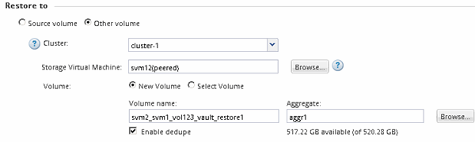

= SnapVault バックアップからデータをリストアする
:allow-uri-read: 
:icons: font
:imagesdir: ../media/

[role="lead"]
SnapVault バックアップデスティネーションボリュームを選択したら、リストア処理を実行する必要があります。バックアップしたデータをテストする場合は新しいボリュームにリストアし、データが失われたか破損した場合は既存のボリュームにリストアします。

.このタスクについて
このタスクは、 * デスティネーション * クラスタから実行する必要があります。

.手順
. 実行している System Manager のバージョンに応じて、次のいずれかの手順を実行します。
+
** ONTAP 9.4 以前： ［ * 保護 * ］ > ［ * 関係 * ］ をクリックします。
** ONTAP 9.5 以降： * Protection * > * Volume Relationships * をクリックします。

. SnapVault バックアップデスティネーションボリュームが格納された SVM を選択し、 * Operations * > * Restore * をクリックします。
. [ * リストア * ] ダイアログ・ボックスで、元のソース・ボリュームまたは新しいボリュームにデータをリストアします。
+
|===
| リストア先 | 作業 

 a| 
元のソースボリューム
 a| 
「 * ソースボリューム * 」を選択します。

 a| 
新しいボリューム
 a| 
.. 「 * Other volume * （その他のボリューム）」を選択
.. ボリュームとピア関係にあるクラスタおよび SVM を選択します。
.. ピア関係にある SVM をリストから選択します。
.. SVM にピア関係が設定されていない場合は、 SVM のピア関係を作成します。
+
... SVM を選択します。
... [* Authenticate] をクリックします。
... ピアクラスタのクラスタ管理者のクレデンシャルを入力し、 * Create * をクリックします。

.. 「 * New Volume （新規ボリューム）」を選択します
.. デフォルトの名前を変更する場合は、次の形式で表示されます。 `destination_SVM_name_destination_volume_name_restore`で、新しい名前を指定し、ボリュームの包含アグリゲートを選択します。
.. [ 重複排除を有効にする *] チェックボックスをオンにします。

|===
+

. 最新の Snapshot コピーを選択するか、リストアする特定の Snapshot コピーを選択します。
. Snapshot コピーからボリュームをリストアする場合は「 * OK 」チェックボックスを選択します。
. リストア処理中に転送されるデータを圧縮するには、 [ ネットワーク圧縮を有効にする ] チェックボックスをオンにします。
. [* リストア ] をクリックします。
+
リストア処理の間、リストア対象のボリュームは読み取り専用に変更されます。リストア処理が完了すると、一時的な関係が削除され、リストアしたボリュームが読み書き可能に変更されます。

+
image::../media/restore_configuration.gif[ボリュームのリストア処理の結果]

. メッセージボックスの *OK* をクリックします。

